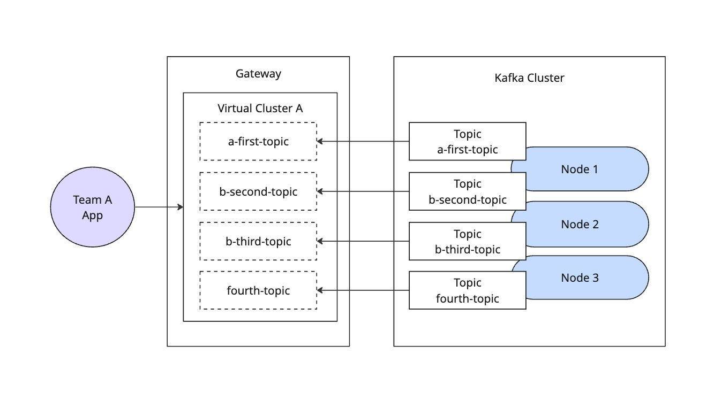

# Lab 01: Basic Kafka Proxy Example

This example demonstrates the basic proxy functionality of Kong Event Gateway, allowing clients to connect to a Kafka cluster through a proxy layer with anonymous authentication.

## Overview

The setup provides:
- Simple proxy configuration for Kafka
- Anonymous authentication
- Direct pass-through of Kafka operations
- No message transformation or additional processing



## Configuration Details

The snippet below contains the minimal configuration needed for a Kafka proxy:

```yaml
backend_clusters:
  - name: kafka-localhost
    bootstrap_servers:
      - localhost:9092
      - localhost:9093
      - localhost:9094

listeners:
  port:
    - listen_address: 0.0.0.0
      listen_port_start: 19092

virtual_clusters:
  - name: team-a
    backend_cluster_name: kafka-localhost
    route_by:
      type: port
      port:
        min_broker_id: 1
    authentication:
      - type: anonymous
        mediation:
          type: anonymous
```

Key configuration points:
- Virtual cluster listening on port 19092
- Anonymous authentication for easy testing
- Direct routing to backend Kafka cluster

## Apply Configuration

1. Go to the [Konnect web console](https://cloud.konghq.com)
2. Select your control plane
3. Click "Configuration"
4. Click "Add configuration"
5. Replace the existing configuration with the snippet above
6. Click "Save"

## Testing

Restart the data plane container to apply the new configuration:
```bash
docker restart knep-konnect
```

Using `kafkactl`, you can test both direct and proxied connections:

1. Direct connection to Kafka:
```bash
kafkactl config use-context backend
kafkactl create topic a-first-topic b-second-topic b-third-topic fourth-topic
kafkactl produce a-first-topic --value="Hello World"
```

2. Connection through proxy:
```bash
kafkactl config use-context team-a
kafkactl consume a-first-topic --from-beginning --exit
```

## Use Cases

This basic proxy setup is ideal for:
- Learning and testing Kong Event Gateway
- Development environments
- Simple Kafka proxy needs
- Network segmentation scenarios
