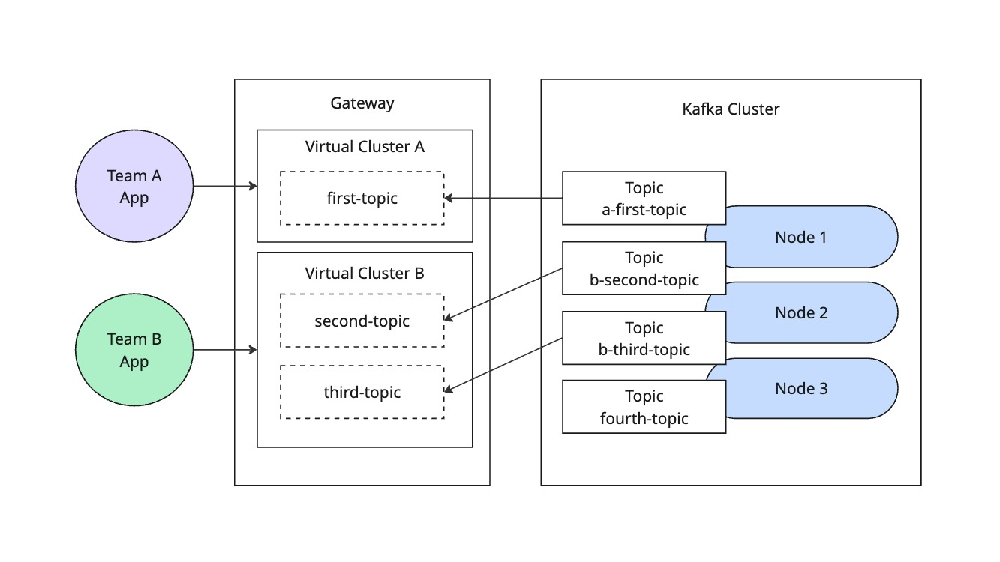

# Lab 02: Tenant Isolation with Topic Prefixing

This example demonstrates how to configure Kong Event Gateway to automatically filter topic names using prefixes.

## Overview

The setup provides:
- Automatic topic name prefixing
- Prefix-based topic filtering
- Transparent operation for clients
- Anonymous authentication for easy testing



## Configuration Details

The snippet below demonstrates topic filtering configuration with multiple virtual clusters:

```yaml
virtual_clusters:
  - name: team-a
    backend_cluster_name: kafka-localhost
    route_by:
      type: port
      port:
        min_broker_id: 1
    authentication:
      - type: anonymous
        mediation:
          type: anonymous
    topic_rewrite:
      type: prefix
      prefix:
        value: a-
  - name: team-b
    backend_cluster_name: kafka-localhost
    route_by:
      type: port
      port:
        offset: 10000
        min_broker_id: 1
    authentication:
      - type: anonymous
        mediation:
          type: anonymous
    topic_rewrite:
      type: prefix
      prefix:
        value: b-
```

Key configuration points:
- Two virtual clusters with different prefixes: "a-" for team-a and "b-" for team-b
- Team-a accessible on port 19092, team-b on port 29092
- All topics accessed through each proxy will be prefixed accordingly
- Original topic names preserved in the client view
- Transparent prefix handling for clients

## Apply Configuration

1. Go to the [Konnect web console](https://cloud.konghq.com)
2. Select your control plane
3. Click "Configuration"
4. Click "Edit configuration"
5. Replace the existing configuration section for `virtual_clusters` with the snippet above
6. Click "Save"

## Testing topic filtering

Restart the data plane container to apply the new configuration:
```bash
docker restart knep-konnect
```

Using `kafkactl`, test the topic filtering:

1. Create topics directly in Kafka if you haven't already:
    ```bash
    kafkactl config use-context backend
    kafkactl create topic a-first-topic b-second-topic b-third-topic fourth-topic
    ```

2. Access team-a topics through the proxy:
    ```bash
    kafkactl config use-context team-a
    kafkactl get topics
    ```
    Should only see "first-topic" (without the "a-" prefix)

3. Access team-b topics through the proxy:
    ```bash
    kafkactl config use-context team-b
    kafkactl get topics
    ```
    Should only see "second-topic" and "third-topic" (without the "b-" prefix)

## Testing topic name overlap

1. Create a new topic through the team-a proxy:
    ```bash
    kafkactl config use-context team-a
    kafkactl create topic my-new-topic
    ```
    Should see "my-new-topic" in the list of team-a topics

2. Create a new topic through the team-b proxy:
    ```bash
    kafkactl config use-context team-b
    kafkactl create topic my-new-topic
    ```
    Should see "my-new-topic" in the list of team-b topics

3. Verify the actual topic names in Kafka:
    ```bash
    kafkactl config use-context backend
    kafkactl get topics
    ```
    Should see all topics with their prefixes: "a-first-topic", "b-second-topic", etc.
