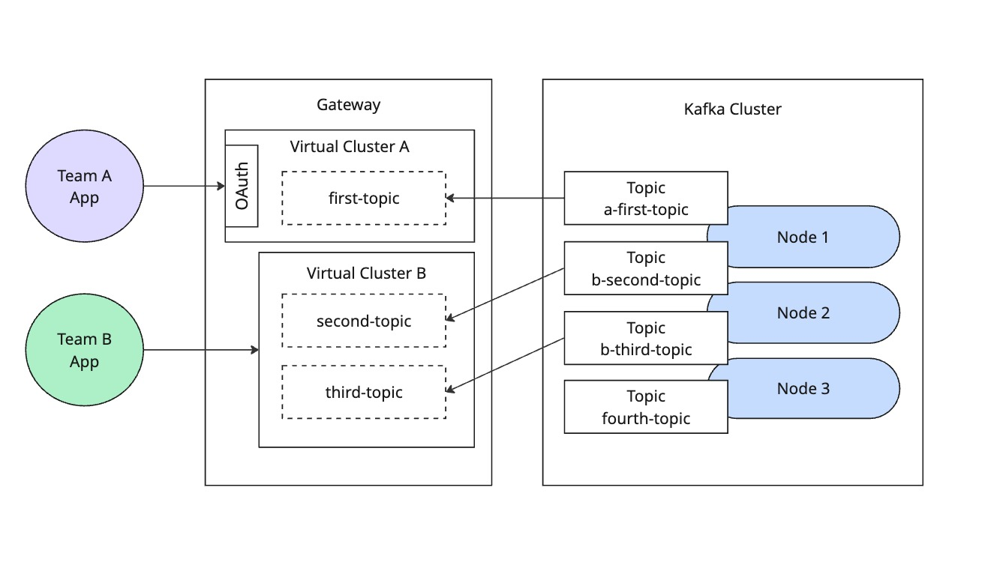

# Lab 03: Authentication Mediation with Kong Event Gateway

This lab demonstrates how to implement advanced authentication mediation using Kong Event Gateway, enabling both secure JWT-based and anonymous access to your Kafka clusters.

## Overview

The setup provides:

- Dual authentication configurations
- Anonymous access on port 19092
- JWT-authenticated access on port 29092
- Authentication mediation between clients and Kafka



## Configuration Details

The following configuration demonstrates two virtual clusters with different authentication methods:

```yaml
virtual_clusters:
  - name: team-a
    authentication:
      - type: sasl_oauth_bearer
        sasl_oauth_bearer:
          jwks:
            endpoint: http://keycloak:8080/realms/kafka-realm/protocol/openid-connect/certs
            timeout: "1s"
        mediation:
          type: anonymous
    backend_cluster_name: kafka-localhost
    route_by:
      type: port
      port:
        min_broker_id: 1
    rewrite_ids:
      type: prefix
    topic_rewrite:
      type: prefix
      prefix:
        value: a-
  - name: team-b
    authentication:
      - type: anonymous
        mediation:
          type: anonymous
    backend_cluster_name: kafka-localhost
    route_by:
      type: port
      port:
        offset: 10000
        min_broker_id: 1
    rewrite_ids:
      type: prefix
    topic_rewrite:
      type: prefix
      prefix:
        value: b-
```

### Configuration Breakdown

1. **Team-A Virtual Cluster (JWT-authenticated)**:

   - Uses SASL OAuth Bearer authentication
   - Integrates with Keycloak for JWT validation
   - Listens on default port (19092)

2. **Team-B Virtual Cluster (Anonymous)**:
   - Allows anonymous access
   - Listens on offset port (29092)

## Testing the Configuration

Test both authentication methods using `kafkactl`:

1. Anonymous access (Team-B):

   ```bash
   # Configure kafkactl for anonymous access
   kafkactl config use-context virtual

   # Create and verify topic
   kafkactl create topic test-topic
   kafkactl list topics

   # Produce test message
   kafkactl produce test-topic --value="Hello World"

   # Consume to verify
   kafkactl consume test-topic --from-beginning
   ```

2. JWT-authenticated access (Team-A):

   ```bash
   # Switch context and attempt to create topic
   kafkactl config use-context secured
   kafkactl create topic secure-topic
   ```

3. (Optional) Get token and use apache kafka shell scripts with oauthbreaker config

   ```bash
   # Get JWT token from Keycloak
   TOKEN=$(curl -X POST http://localhost:8180/realms/kafka-realm/protocol/openid-connect/token \
   -d "grant_type=client_credentials" \
   -d "client_id=kafka-client" \
   -d "client_secret=secret123" | jq -r '.access_token')
   ```
