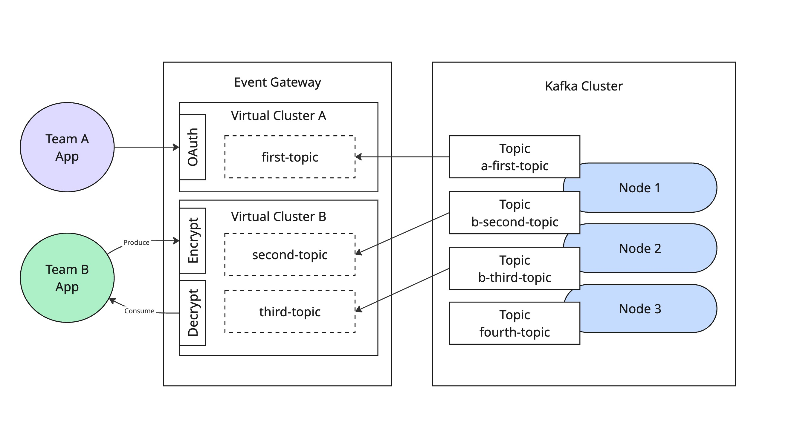

# Lab 04: Message-Level Encryption with Policies

This lab demonstrates how to configure Kong Event Gateway for automatic message encryption and decryption using symmetric key encryption.

## Overview

The setup provides:

- Automatic encryption of messages during production
- Automatic decryption of messages during consumption
- Symmetric key encryption using a 128-bit key
- Transparent encryption/decryption (clients don't need to handle encryption)



## Configuration Details

The snippet below demonstrates message encryption configuration with multiple virtual clusters:

```yaml
virtual_clusters:
  - name: team-a
    backend_cluster_name: kafka-localhost
    route_by:
      type: port
      port:
        min_broker_id: 1
    authentication:
      - type: anonymous
        mediation:
          type: anonymous
    rewrite_ids:
      type: prefix
    topic_rewrite:
      type: prefix
      prefix:
        value: a-
  - name: team-b
    backend_cluster_name: kafka-localhost
    route_by:
      type: port
      port:
        offset: 10000
        min_broker_id: 1
    authentication:
      - type: anonymous
        mediation:
          type: anonymous
    rewrite_ids:
      type: prefix
    topic_rewrite:
      type: prefix
      prefix:
        value: b-
    produce_policies:
      - policies:
          - type: policy
            policy:
              name: encrypt
              type: encrypt
              encrypt:
                failure:
                  mode: error
                encrypt:
                  - type: value
                    id: "static://key-0"
                key_sources:
                  - type: key_source
                    key_source:
                      type: static
                      name: inline-key
                      static:
                        - id: "static://key-0"
                          key:
                            type: bytes
                            bytes:
                              value: "7oMACUhuRn+Aq3aEylG87w=="
    consume_policies:
      - policies:
          - type: policy
            policy:
              name: decrypt
              type: decrypt
              decrypt:
                failure:
                  mode: error
                decrypt:
                  - type: value
                key_sources:
                  - type: key_source
                    key_source:
                      type: static
                      name: inline-key
                      static:
                        - id: "static://key-0"
                          key:
                            type: bytes
                            bytes:
                              value: "7oMACUhuRn+Aq3aEylG87w=="
```

Key configuration points:

- `produce_policies` section configures encryption
- `consume_policies` section configures decryption
- `failure: mode: error` ensures policy failure results in an error
- `key_sources` defines the encryption key
- `value: "7oMACUhuRn+Aq3aEylG87w=="` is the base64-encoded 128-bit encryption key

## Testing

Using kafkactl, you can test the encryption:

1. Produce a message through the proxy (will be encrypted):

```bash
echo "secret message" | kafkactl --context team-b produce my-topic
```

2. Consume through the proxy (will be decrypted):

```bash
kafkactl --context team-b consume my-topic --from-beginning
```

3. Consume directly from Kafka (will be encrypted):

```bash
kafkactl --context default consume b-my-topic --from-beginning
```

## Configuration Details

The configuration includes:

- Produce policies that encrypt all message values
- Consume policies that decrypt all message values
- Error handling for encryption/decryption failures
- Static key configuration for simplicity

## Security Considerations

- The encryption key is stored in plain text in the configuration file
- In production environments, use secure key management solutions
- The example uses network_mode: host for simplicity; adjust for production
- Messages are encrypted at rest in Kafka
- Only consumers through the proxy can decrypt messages

## Troubleshooting

Common issues:

1. Encryption failures:

   - Verify the key is correctly base64 encoded
   - Ensure the key is exactly 16 bytes (128 bits) before base64 encoding

2. Decryption failures:
   - Confirm the same key is used in both produce and consume policies
   - Verify messages were produced through the proxy
